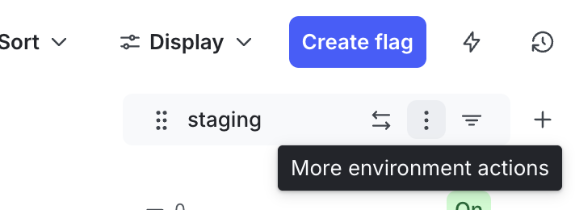
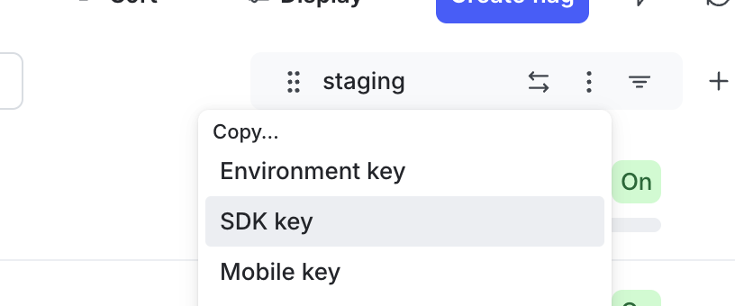

# ExLaunchDark

Elixir Launch Darkly integration library

## Installation

If [available in Hex](https://hex.pm/docs/publish), the package can be installed
by adding `ex_launch_dark` to your list of dependencies in `mix.exs`:

```elixir
def deps do
  [
    {:ex_launch_dark, "~> 0.1.0"},
    # or using git source
    {:ex_launch_dark, git: "url_to_repo", tag: "1.1.0"}
  ]
end
```

## Configuration

The client requires a Launch Darkly SDK key to connect to the service.
You can get this key from your Launch Darkly account.

Then in the host application configuration file, typically `config/config.exs` or `config/runtime.exs`, add:

```elixir
# List all project keys to be used
config :ex_launch_dark, :projects, [:project_key_1, :project_key_n]
# Defined shared url among all different project clients
config :ex_launch_dark, :base_uri, "https://app.launchdarkly.com"   
# For each project, add its own SDK key
config :ex_launch_dark, :project_key_1, "sdk-xxxxx-yyyyy-zzzzzzz-11111"
config :ex_launch_dark, :project_key_n, "sdk-xxxxx-yyyyy-zzzzzzz-22222"
```

## Usage

To start using the library main functions you can start playing with the `ExLaunchDark.LDAdapter` module.
Which exposes some of the most common flag operations, like:

```elixir
# Retrieve the current value of any given feature flag 

ld_ctx = %ExLaunchDark.LDContextStruct{key: "ctx_key_123", kind: "user"}

case ExLaunchDark.LDAdapter.get_feature_flag_value(:project_key_1, "flag_foo", ld_ctx, false) do
  {:ok, value, _reason} -> 
    # All good, use the value
  {:error, _default, reason} -> 
    # Something went wrong, handle the error using given reason
end

# Retrieve the current value of a feature flag using a multi-context
# (e.g. application + user in a single evaluation)

app_ctx =
  %ExLaunchDark.LDContextStruct{
    key: "my_app_backend",
    kind: "service",
    attributes: %{}
  }

user_ctx =
  %ExLaunchDark.LDContextStruct{
    key: "user_123",
    kind: "user",
    attributes: %{
      "country" => "uk",
      "roles" => ["admin"]
    }
  }

multi_ctx =
  %ExLaunchDark.LDMultiContextStruct{
    contexts: [app_ctx, user_ctx]
  }

case ExLaunchDark.LDAdapter.get_feature_flag_value(
       :project_key_1,
       "flag_foo",
       multi_ctx,
       false
     ) do
  {:ok, value, _reason} ->
    # All good, use the value
  {:error, _default, reason} ->
    # Something went wrong, handle the error using given reason
end
```

NOTE: Elixir generally prefers underscores rather than hypens (e.g. "flag_foo" rather than "flag-foo") but Launchdarkly idioms prefer hyphens. `ExLaunchDark.LDAdapter.get_feature_flag_value` makes no assumptions nor enforcement
of this. If you want to use the Launchdarkly style for your `flag_key` then use `ExLaunchDark.LDAdapter.normalise` first.

## In-memory adapter (testing & local development)

For testing or local development, the library provides an in-memory adapter
based on ETS:

`ExLaunchDark.InMemoryAdapter`

This adapter implements the same interface as `ExLaunchDark.LDAdapter`, but
stores feature flag overrides in memory.

⚠️ **Do not use this adapter in production.**
Data stored in ETS is lost on application restart and is local to a single node.

### Example usage

```elixir
# Enable the in-memory adapter in your application config (compile time)
config :my_app, :feature_flags_adapter, ExLaunchDark.InMemoryAdapter

# Override a flag value
ExLaunchDark.InMemoryAdapter.enable("example-feature-flag")

# Disable a flag
ExLaunchDark.InMemoryAdapter.disable("example-feature-flag")

# Clear all overrides
ExLaunchDark.InMemoryAdapter.clear_flags()
```

Externally defined adapters must implement the `ExLaunchDark.Adapter` behaviour, which defines the
`get_feature_flag_value/4` callback used for flag evaluation.

## Development

In order run this project isolated, you need to ensure you have first installed manually the ``asdf``
tool manager in your host machine, then run:

```bash
asdf install
```

which will install the required Erlang and Elixir versions as specified in the `.tool-versions` file.

Then you can fetch the dependencies with:

```bash
mix deps.get
mix deps.compile
``` 

## Connecting to staging

There is a [script](./scripts/connect_to_staging.exs) which you can `mix run ./scripts/connect_to_staging.exs <project_key> <sdkkey> <flag_key>` (read the [script](./scripts/connect_to_staging.exs) for more details).

To find your SDK key in Launchdarkly, open up your project in LD and click on the three vertical dots in the "Staging" elements on the right:



and choose "SDK key".



### Application commands

In order to ease some of the common development tasks, you can use any of the "commands/tasks"
defined in the `mise.toml` file, like:

```bash
mise start 
mise test
mise code:check 
mise code:format
```

## Release

### Bump the new version and push to GH

To bump the version in the `mix.exs` file run one of the following:

```bash
mix bump patch
mix bump minor
mix bump major
```

This can be done on the current branch/PR or, if the PR is particularly complex or there are multiple PRs, create a new branch for a new release.

### Perform the actual release

This project isn't integrated with `suite-py` yet so the release must be created manually:

1. Go to https://github.com/primait/ex-launch-dark/releases
2. Click "Draft a new release"
3. Create a new tag that is the new version (e.g. if the new version is 1.1.3 then the tag is called "1.1.3")
4. Create the release

This will then kick off the build-and-release-to-hex workflow.

Documentation can be generated with [ExDoc](https://github.com/elixir-lang/ex_doc)
and published on [HexDocs](https://hexdocs.pm). Once published, the docs can
be found at [https://hexdocs.pm/ex_launch_dark](https://hexdocs.pm/ex_launch_dark).
